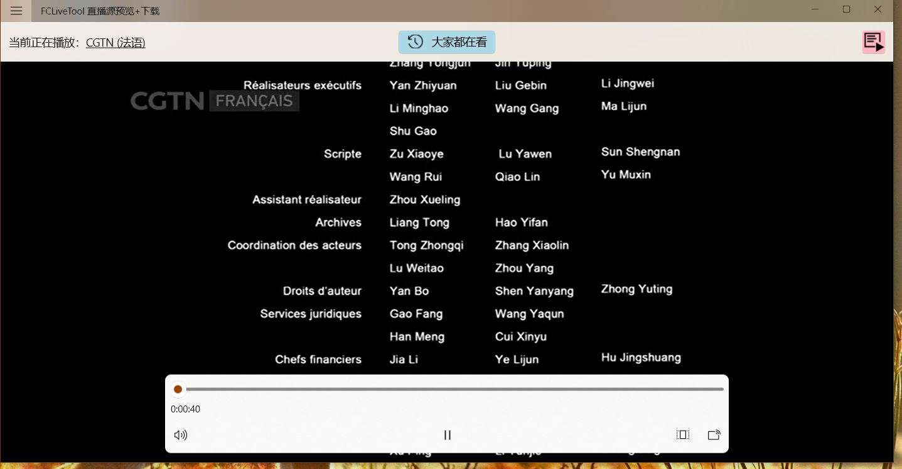
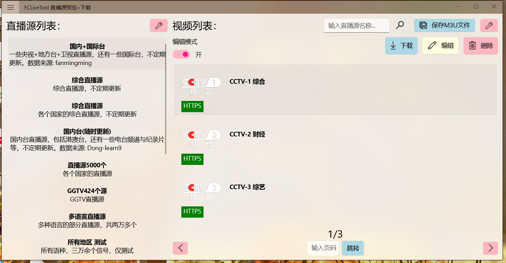
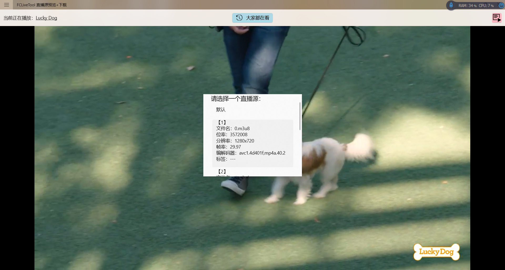
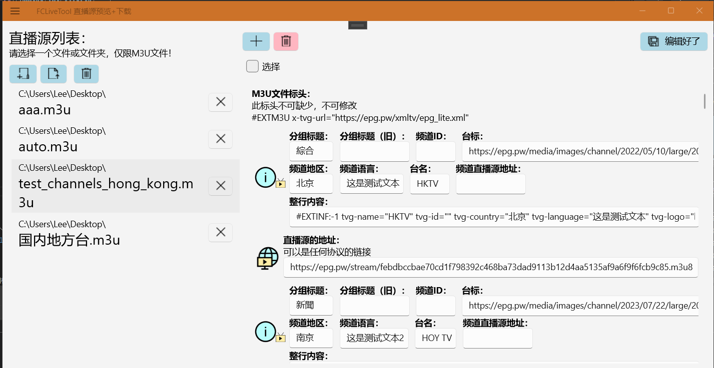
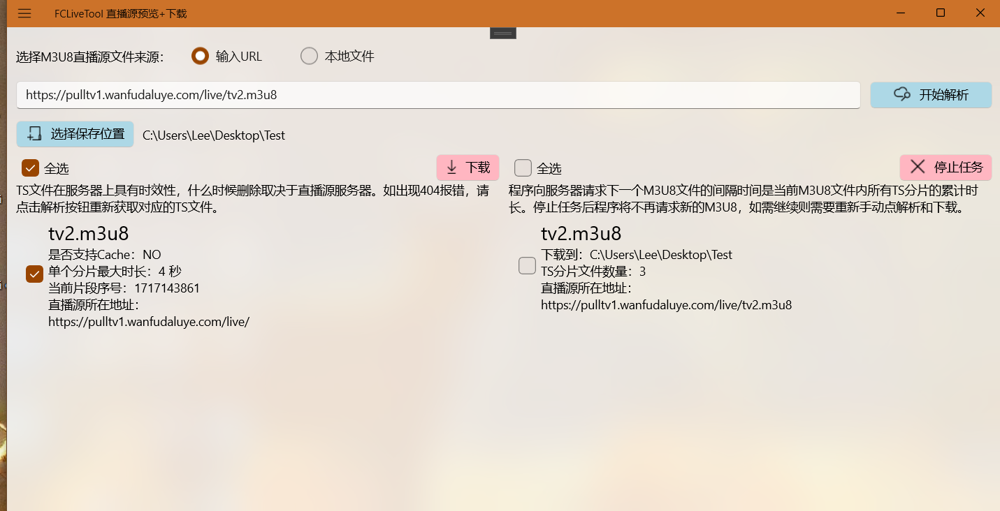
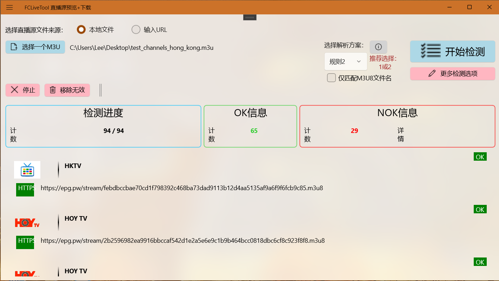
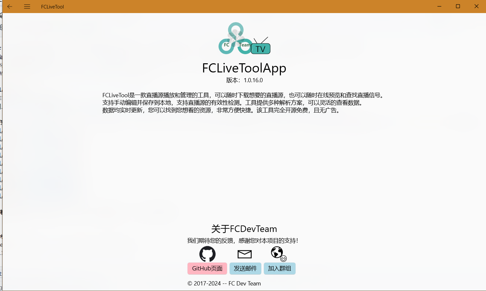

  
  
# FCLiveTool  
网页端程序
  
FCLiveTool是一款直播源观看和管理的工具，您可以随时下载想要的直播源，也可以随时在线观看和查找直播信号。支持手动编辑并保存到本地，支持直播源的有效性检测。工具提供多种解析方案，可以灵活的查看数据。数据均实时更新，您可以找到您想看的资源，非常方便快捷。该工具完全开源免费，且暂无广告。  
**网址  https://fclivetool.com**  
  
  
  
**本Web项目下载下来后并不能直接运行，需要您自行配置您的数据库，以及编写控制器代码，以及数据模型仅供参考，以上内容请根据自己的需求进行修改**  
//建议有编程能力的人下载项目。  
//由于上传部分代码可能会影响到站点的正常运行，如控制器(Controller)的代码。所以不会上传至Git，需要您自行编写代码。  
//网页版的播放器使用了开源的Video.js，在此表示感谢巨人提供的肩膀  
  
# FCLiveToolApplication  
基于微软的.NET MAUI开发的跨平台程序  
  
  
跨平台应用程序，可以在 Win/Android 上运行，IOS暂未适配。一个简单的小程序，项目下载下来就可以直接编译运行，注意不要忘记安装MAUI相关开发框架，可以在Visual Studio Installer内看到。  
  
  
  
  
  
  
  
  
  
**如有意见或者问题请提出，感谢您的支持。项目会不断更新，少不了各位的贡献。**

  
# 开发者联系方式  
邮箱：justineedyoumost@163.com 或 wzzedznhl3@outlook.com  
QQ：3524984135
