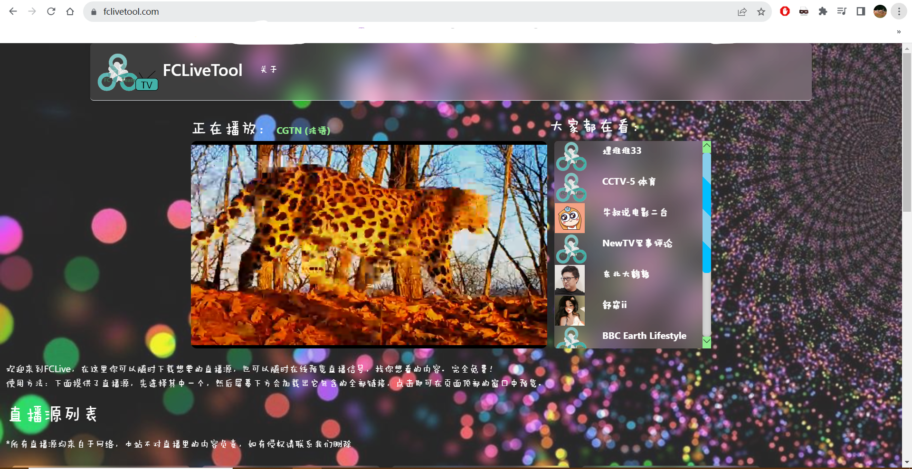
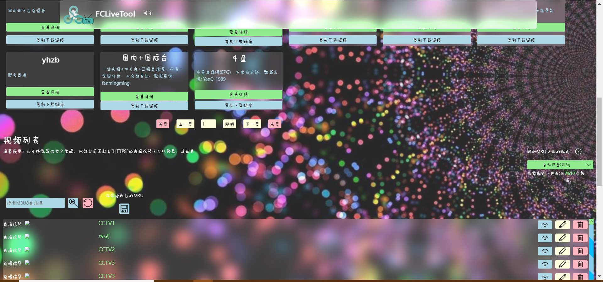

  
  
# FCLiveTool  
网页端程序
  
FCLiveTool 是一个可以在线预览，下载直播源的网站，为有需要的人提供方便。您可以在线查看您想看的直播信号，也可以将直播源下载后导入到您的播放软件里。  
该服务完全免费，且无广告。  
**网址  https://fclivetool.com**  
  
  
  
**本Web项目下载下来后并不能直接运行，需要您自行配置您的数据库，以及编写控制器代码，以及数据模型仅供参考，以上内容请根据自己的需求进行修改**  
//建议有编程能力的人下载项目。  
//由于上传部分代码可能会影响到站点的正常运行，如控制器(Controller)的代码。所以不会上传至Git，需要您自行编写代码。  
//网页版的播放器使用了开源的Video.js，在此表示感谢巨人提供的肩膀  
  
# FCLiveToolApplication  
基于微软的.NET MAUI开发的跨平台程序  
  
跨平台应用程序，可以在 Win/Android 上运行，IOS暂未适配。一个简单的小程序，项目下载下来就可以直接编译运行，注意不要忘记安装MAUI相关开发框架，可以在Visual Studio Installer内看到。  
  
**如有意见或者问题请提出，感谢您的支持。项目会不断更新，少不了各位的贡献。**
  
开发者联系方式  
邮箱：justineedyoumost@163.com  
QQ：3524984135
